# WBC Semantic Segmentation Model

* A Mask2Former model is trained on the training split of the WBCAtt+ dataset
* Training code is at [./m2f_tiny_1024_color_20260414_091312](./m2f_tiny_1024_color_20260414_091312).
* The model weight is uploaded to [HuggingFace](https://huggingface.co/apple2373/wbcsegmentor_m2f_tiny/blob/main/model_epoch%3D050.ckpt)
* Put `model_epoch=050.ckpt` in the directory [./m2f_tiny_1024_color_20260414_091312](./m2f_tiny_1024_color_20260414_091312).
* See [./results_sample_in_the_wild.ipynb](./results_sample_in_the_wild.ipynb) to learn how to use. 

## Environment
- The commands used to make the environment:
```
conda create -n wbcsegmentor python=3.12.13
conda activate wbcsegmentor
pip install uv
uv pip install torch==2.10.0 torchvision --index-url https://download.pytorch.org/whl/cu128
uv pip install ipykernel
python -m ipykernel install --user --name wbcsegmentor 
uv pip install transformers==5.5.0
uv pip install requests
uv pip install matplotlib pandas tqdm pillow scikit-learn seaborn numpy scipy opencv-python ipywidgets gitpython nvitop gpustat scikit-image pyyaml
```
- See [environment.yml](environment.yml). 


## Evaluation on WBCAtt+ dataset
- See [./results_pbc_eval.ipynb](./results_pbc_eval.ipynb) for more details and more examples.

| Class Index | Class Name          |   IoU (%) |
| ----------- | ------------------- | --------: |
| 0           | (Background)          |     (99.32) |
| 1           | Cytoplasm           |     96.67 |
| 2           | Nucleus             |     98.14 |
| 3           | Platelets           |     92.91 |
| 4           | RedBloodCell                |     99.43 |
| 5           | Vacuoles            |     81.20 |

Mean IoU (mIoU)  without Background class:  93.67 

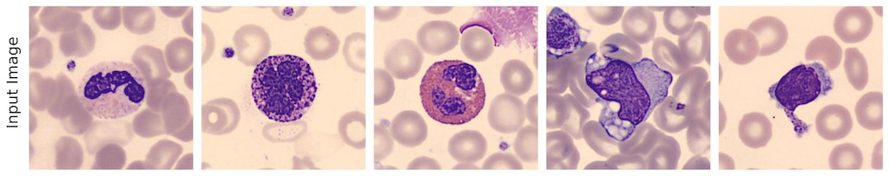
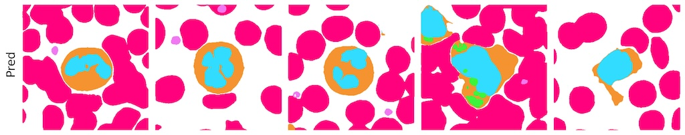
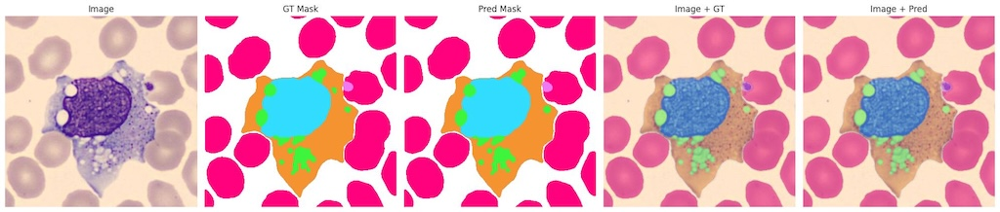
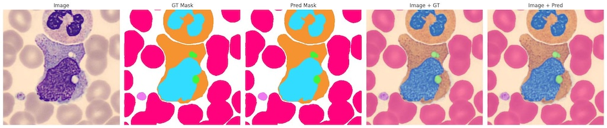
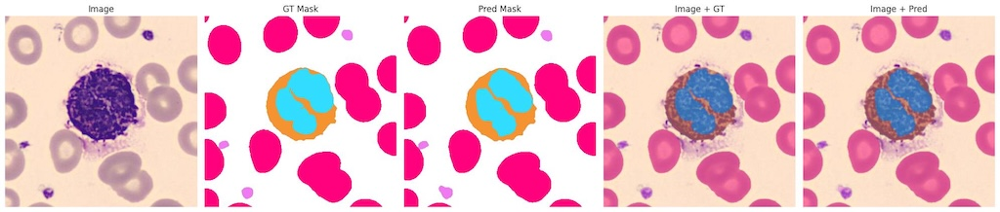

## Sample Results in the Wild
- See [./results_sample_in_the_wild.ipynb](./results_sample_in_the_wild.ipynb). 
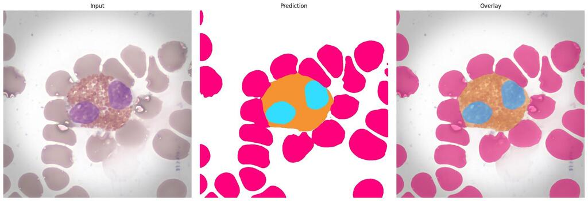
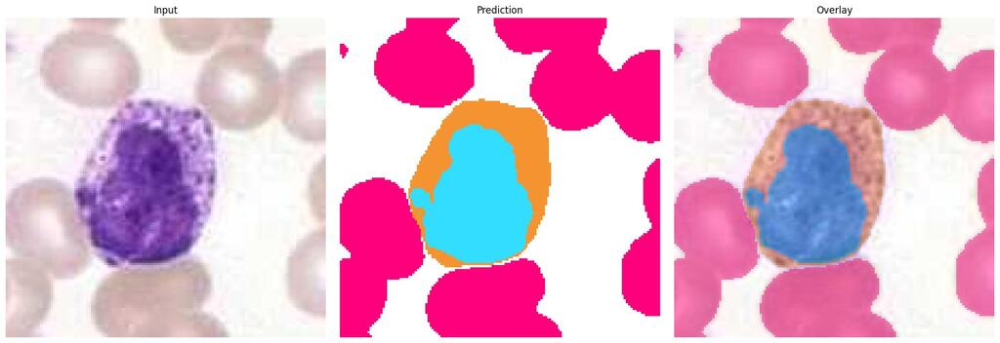
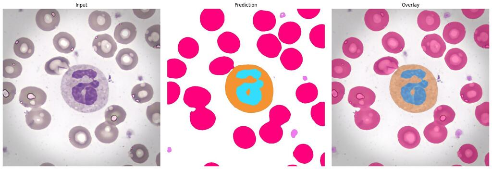
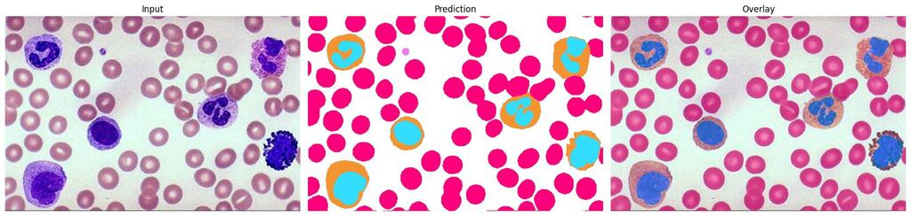
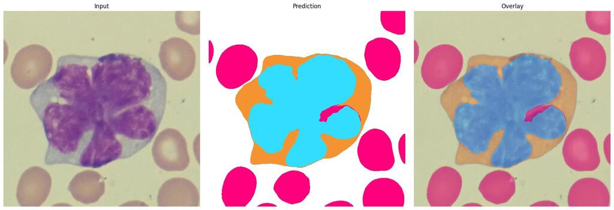
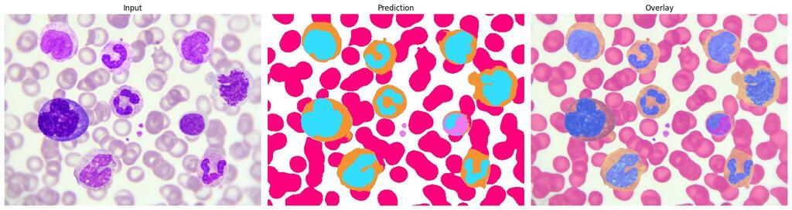
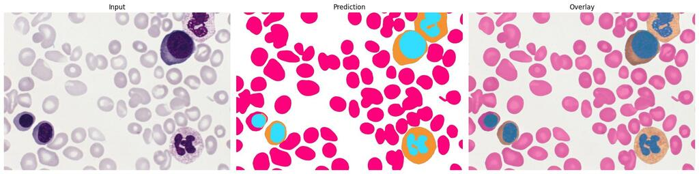


## Reference*

*The model trained in this repository is not used in the paper. The Mask2Former here is trained using Transformers library, while the [one reported in the paper](https://github.com/apple2373/wbcattplus/tree/main/Mask2Former) is based on Mask2Former's official codebase.

If you find this code or pretrained model useful, please consider citing:

* Satoshi Tsutsui, Winnie Pang, Shuting He, and Bihan Wen, “WBCAtt+: Fine-Grained Pixel-Level Morphological Annotations for White Blood Cell Images,” *Medical Image Analysis*, 2026.
* *ArXiv*: [http://arxiv.org/abs/2605.19692](http://arxiv.org/abs/2605.19692)

```
@article{tsutsui2026wbcattplus,
  title={WBCAtt+: Fine-Grained Pixel-Level Morphological Annotations for White Blood Cell Images},
  author={Tsutsui, Satoshi and Pang, Winnie and He, Shuting and Wen, Bihan},
  journal={Medical Image Analysis},
  year={2026}
}
```
